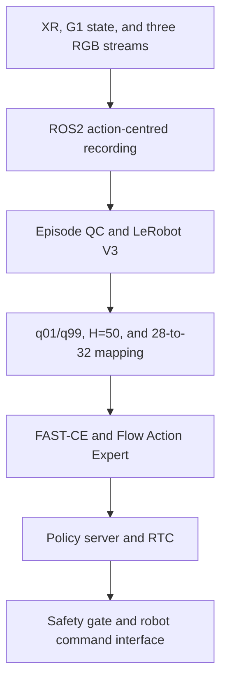

# Implementation-to-Code Map

This document maps each project capability to its main implementation entry points. The repository is an unofficial **π0.7-inspired research implementation** built on the public OpenPI π0.5 PyTorch Flow Matching path.

| Capability | Main entry points | Implemented scope |
|---|---|---|
| G1 teleoperation and acquisition | `src/g1_pi07/joints.py`, `src/g1_pi07/teleop/`, `ros2_ws/src/g1_pi07_bringup/g1_pi07_bringup/xr_udp_bridge_node.py`, `teleop_action_node.py`, `state_adapter_node.py` | Fixed 43-DoF order, XR calibration, two wrist poses, 21x3 hand keypoints, dual-arm MoveIt IK, dual Dex3-1 retargeting, `q/dq/tau_est[43]`, and IMU adaptation |
| Multimodal data pipeline | `src/g1_pi07/data/types.py`, `time_sync.py`, `storage.py`, `episode_recorder_node.py`, `scripts/validate_g1_episodes.py`, `scripts/split_g1_episodes.py`, `examples/unitree_g1/data/convert_g1_session_to_lerobot.py` | Action-centred nearest-neighbour alignment, bounded wait windows, MCAP/Parquet/three MP4 streams, QC, episode-level splits, LeRobot V3 conversion, and traceability mapping |
| State and action preprocessing | `src/g1_pi07/joints.py`, `data/chunks.py`, `data/normalization.py`, `src/openpi/policies/unitree_g1_policy.py`, `src/openpi/transforms.py`, `src/openpi/training/g1_training.py`, `scripts/compute_norm_stats.py` | 43-to-28-to-32 mapping, four padded dimensions, dimension masks, H=50 repeat-last padding, step masks, training-only `q01/q99`, and consistent inverse normalization |
| π0.5/π0.7-inspired model | `src/openpi/models/pi0_config.py`, `src/openpi/models_pytorch/pi0_pytorch.py`, `src/openpi/models/tokenizer.py`, `src/openpi/transforms.py`, `src/openpi/policies/policy.py` | PaliGemma multimodal prefix, discrete proprioception, continuous action suffix, FAST teacher branch, current-subtask autoregressive generation, and 10-step `[50,32]` Flow Matching sampling |
| Training workflow | `src/g1_pi07/training/objectives.py`, `src/openpi/training/g1_training.py`, `src/openpi/training/config.py`, `src/openpi/training/data_loader.py`, `scripts/train_pytorch.py`, `scripts/make_g1_recap_sidecar.py` | Flow-only behaviour cloning, joint FAST-CE + Flow training, explicit Stop-Gradient Knowledge Insulation, MEM/RECAP-style sidecars, sample weights, checkpoints, and small-episode overfit configuration |
| Evaluation and closed-loop integration | `examples/unitree_g1/eval/`, `examples/unitree_g1/common/`, `examples/unitree_g1/rtc/`, `examples/unitree_g1/deploy/g1_pi07_client.py`, `src/openpi/serving/websocket_policy_server.py`, `robot_command_adapter_node.py` | Holdout action replay, deterministic-noise evaluation, asynchronous policy process, RTC hard prefix, latency skipping, rolling replanning, inverse normalization, safety checks, and command publication |

## Data flow

