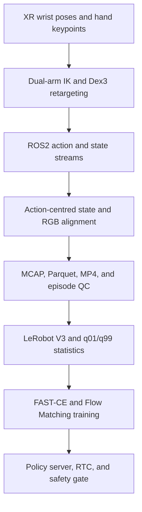

# Unitree G1 43-DoF π0.7-Inspired OpenPI Reproduction

This repository is a research implementation of an end-to-end vision-language-action pipeline for a Unitree G1 43-DoF humanoid equipped with two Dex3-1 hands and three RGB cameras. It covers XR teleoperation, ROS2 recording, action-centred temporal alignment, episode validation, LeRobot conversion, model training, asynchronous action-chunk inference, and safety-gated deployment.

> This is not an official Physical Intelligence π0.7 release. The executable model path is based on the public OpenPI π0.5 PyTorch Flow Matching implementation. Hierarchical subtask generation, FAST action-token supervision, Knowledge Insulation, RTC, and lightweight MEM/RECAP-style metadata are experimental integrations inspired by public research descriptions.

## Implementation status

### Implemented in this repository

- A fixed G1 43-DoF joint contract with a 28-dimensional upper-body policy space and a 32-dimensional model action space.
- XR wrist-pose calibration, dual-arm IK interfaces, and Dex3-1 keypoint retargeting.
- ROS2 messages and nodes for `q/dq/tau_est[43]`, IMU, action targets, approved commands, and three RGB streams.
- Action-timestamp-centred nearest-neighbour alignment with explicit signed timing offsets and acceptance thresholds.
- MCAP, Parquet, MP4, and metadata recording; episode-level validation and deterministic train/validation/test splitting.
- Raw episode to LeRobot V3 conversion, plus an optional V3-to-V2.1 compatibility utility for OpenPI workflows.
- Future action chunks with `H=50`, repeat-last tail padding, step masks, 28-to-32 padding, and dimension masks.
- Per-dimension training-split `q01/q99` statistics used consistently for normalization and inverse normalization.
- PaliGemma prefix processing, discrete proprioception, a continuous Flow Matching Action Expert, and 10-step Euler sampling.
- A FAST teacher-forcing branch, current-subtask autoregressive generation, and an explicit Stop-Gradient Knowledge Insulation boundary.
- Asynchronous policy execution, RTC hard-prefix conditioning, action-chunk caching, latency alignment, and rolling replanning.
- Offline holdout replay, checkpoint integration, joint-limit checks, state-freshness checks, emergency-stop checks, and dry-run deployment.

### Partially implemented research extensions

- RECAP-style fields provide success, failure, intervention, advantage, and sample-weight metadata. They do not implement the complete official RECAP recovery algorithm.
- RL-token metadata can reweight supervised losses. There is no actor-critic network or online reinforcement-learning loop.
- MEM-style text can be appended to the model prompt. This is not a complete persistent memory architecture.
- The ROS2 command boundary publishes a vendor-neutral named `JointState`; it does not include a production Unitree SDK2 motor bridge.

### Work still required

- Validate the exact G1 and Dex3 URDF/SRDF, MoveIt planning groups, joint limits, coordinate frames, and IK behaviour on the target robot.
- Integrate and validate the Unitree SDK2 bridge, the lower-body balance controller, physical emergency stops, collision constraints, and torque/velocity limits.
- Calibrate the XR source clock and all three camera clocks against the robot clock.
- Build the ROS2 workspace in the target ROS2/MoveIt environment and replay real MCAP recordings.
- Train PaliGemma and the Action Expert with real datasets and GPU hardware; record checkpoints, curves, seeds, and evaluation metrics.
- Run safety-approved closed-loop robot trials and report measured success rates, tracking error, collisions, and long-duration stability.
- Add full online RL/actor-critic training, a complete RECAP loop, persistent MEM, Isaac Sim, and Sim-to-Real only if those capabilities are actually developed and validated.

## System flow



The lower-body and waist joints remain in the full 43-dimensional record, but the VLA policy directly controls only the 14 arm joints and 14 hand joints. A separately validated low-level controller must maintain standing and balance on real hardware.

## Data and action contract

| Boundary | Shape | Fixed order |
|---|---:|---|
| Robot state and target | `[43]` | Legs 12 + waist 3 + arms 14 + Dex3 hands 14 |
| VLA state and action | `[28]` | Arms 14 + Dex3 hands 14 |
| Model action chunk | `[50,32]` | First 28 dimensions are active; final 4 dimensions are padded and masked |
| Future-step validity | `[50]` | Real steps are true; repeat-last tail padding is false |
| IMU | `[10]` | Quaternion `xyzw` + angular velocity `xyz` + linear acceleration `xyz` |

The canonical joint order is defined in `src/g1_pi07/joints.py`. Recording, training, normalization, inverse normalization, and deployment validate this order.

## Repository layout

```text
src/g1_pi07/                   G1 joints, synchronization, IK, retargeting, data, and RTC utilities
src/openpi/                    Selected OpenPI model, training, and policy-server components
ros2_ws/src/g1_pi07_interfaces Strongly typed ROS2 messages
ros2_ws/src/g1_pi07_bringup    State adapters, XR teleoperation, recording, safety, and launch files
examples/unitree_g1/           Conversion, evaluation, RTC replay, and dry-run deployment examples
scripts/                       Episode QC, splits, sidecars, statistics, training, and serving entry points
tests/                         Hardware-independent core pipeline tests
docs/reproduction/             Data, objective, RTC, and end-to-end runbook documentation
```

## Environment

Recommended: Ubuntu 22.04 or 24.04, Python 3.11+, CUDA 12, `uv`, and FFmpeg. ROS2 Humble/Jazzy, MoveIt2, Unitree SDK2, and the target G1/Dex3 descriptions are robot-side dependencies and are not installed automatically.

```bash
uv sync
uv run python -m pytest tests -q
```

The PyTorch OpenPI path also requires the upstream Transformers replacement and model assets. Follow [UPSTREAM_OPENPI_README.md](UPSTREAM_OPENPI_README.md) before loading base checkpoints.

## ROS2 build and recording

```bash
python -m pip install -e . --no-deps
cd ros2_ws
colcon build --symlink-install
source install/setup.bash

ros2 launch g1_pi07_bringup record_g1_episode.launch.py \
  episode_id:=pick_box_0001 \
  output_root:=../data/raw \
  task:="Pick up the box with both hands and place it in the target area" \
  subtask:="Reach both hands towards the box"
```

Before stopping the recorder, assign the final label:

```bash
ros2 param set /episode_recorder success_label true
# For a failed episode:
ros2 param set /episode_recorder success_label false
ros2 param set /episode_recorder failure_reason "grasp slipped during lift"
```

The recorder writes `steps.parquet`, `videos/head.mp4`, `videos/left_wrist.mp4`, `videos/right_wrist.mp4`, `metadata.json`, and the raw MCAP bag. See [ros2_ws/README.md](ros2_ws/README.md) for topics and message contracts.

## Episode QC and LeRobot conversion

```bash
uv run python scripts/validate_g1_episodes.py --raw-root ./data/raw
uv run python scripts/split_g1_episodes.py --raw-root ./data/raw --output ./data/splits.json

uv run python examples/unitree_g1/data/convert_g1_session_to_lerobot.py \
  --raw-root ./data/raw \
  --root ./data/lerobot/local/g1_43dof_teleop \
  --repo-id local/g1_43dof_teleop \
  --split-file ./data/splits.json \
  --split train \
  --overwrite
```

The default split excludes failed and unlabeled episodes. The converter also creates `meta/g1_episode_map.json` so that each LeRobot episode remains traceable to the raw episode identifier.

## Training

Compute normalization statistics only from the training split:

```bash
uv run python scripts/compute_norm_stats.py pi07_g1_43dof_joint
```

Run a small overfit test, a Flow-only behaviour-cloning stage, and then the joint FAST-CE + Flow stage:

```bash
uv run python scripts/train_pytorch.py pi07_g1_overfit_smoke --exp-name overfit_3eps
uv run python scripts/train_pytorch.py pi05_g1_43dof_flow --exp-name g1_flow_stage1
uv run python scripts/train_pytorch.py pi07_g1_43dof_joint \
  --exp-name g1_joint_stage2 \
  --pytorch-weight-path ./checkpoints/pi05_g1_43dof_flow/g1_flow_stage1/100000
```

The joint objective is

\[
L = \lambda_{FAST}L_{CE} + \lambda_{flow}L_{FM}.
\]

`L_CE` trains the PaliGemma subtask and action-token branch. `L_FM` trains the continuous Action Expert while the VLM parameters are frozen for that graph. Step, dimension, and RTC-postfix masks are applied before loss reduction. The joint-objective trainer currently supports a single training process; the Flow-only baseline retains DDP support.

## Evaluation and dry-run deployment

```bash
uv run python examples/unitree_g1/eval/eval_g1_holdout.py \
  --checkpoint ./checkpoints/pi07_g1_43dof_joint/g1_joint_stage2/100000 \
  --episode-dir ./data/raw/VALIDATION_EPISODE

uv run python examples/unitree_g1/eval/simulate_rtc_replay.py

uv run python scripts/serve_policy.py policy:checkpoint \
  --policy.config=pi07_g1_43dof_joint \
  --policy.dir=./checkpoints/pi07_g1_43dof_joint/g1_joint_stage2/100000

uv run python examples/unitree_g1/deploy/g1_pi07_client.py \
  --config-path examples/unitree_g1/configs/g1_43dof.example.json
```

Robot commands are disabled by default. The example limits intentionally set `confirmed_from_robot_urdf=false`; the client refuses live publication until verified limits are supplied.

## Documentation

- [CODE_MAP.md](CODE_MAP.md): implementation-to-code mapping and external boundaries.
- [SOURCE_MANIFEST.md](SOURCE_MANIFEST.md): source snapshot and retained scope.
- [VALIDATION.md](VALIDATION.md): checks already run and checks still pending.
- [docs/reproduction/runbook.md](docs/reproduction/runbook.md): end-to-end operating sequence.
- [ACKNOWLEDGEMENTS.md](ACKNOWLEDGEMENTS.md): upstream libraries, model releases, and research references.

## License and attribution

See [LICENSE](LICENSE), [LICENSE_GEMMA.txt](LICENSE_GEMMA.txt), [NOTICE](NOTICE), [UPSTREAM_OPENPI_README.md](UPSTREAM_OPENPI_README.md), and individual source headers. Existing upstream copyright notices are preserved.
